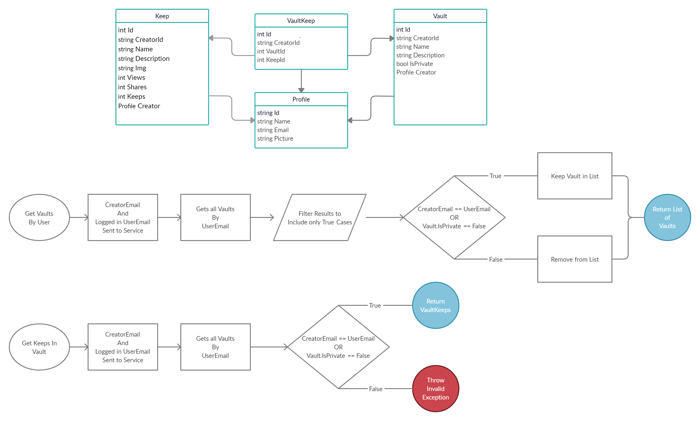

## Keepr Project

Keepr is a social network that allows users to visually share and discover new interests by posting images or videos that can be "kept" in a collection by those who like the content.

> A collection(`vault`) of posts(`keeps`) with a common theme. 

Users can view the profiles of other users to see
- The users name and profile image
- Their public collection of `vaults`
- `Keeps` the user has created

### Application Goals

This was a project to  demonstrate a working knowledge of building full-stack applications. We utilized a VueJs frontend implementing Vuex and Vue-Router to manage the DOM. On the server side we used a DotNet WebApi for their server, implementing the Repository pattern to communicate with our MySql database. In addition we also used Auth0 for user management and Dapper as an ORM.

### The Concepts

Keepr is a typical project where some of the basic layouts have been thought up and the data objects determined. However, implementation of this code is yet to be done. The basic idea is users can browse all of the items (aka `Keeps`) that have been posted without having to login, and post items if they are logged in. If any user wants to store a reference to any particular keep they will store it in the `vault` of their choice. Users can have many vaults, and vaults can be set as public or private.

When a user clicks on a keep from the main page the `keep` should be opened up in a more detailed view (i.e. modal see Mock) where they can then choose to add it to one of their `vault`s.

Vaults themselves are relatively straight forward. They only require a `Name`, `Description`, and `IsPrivate` properties. This object will then be used as a part of a relationship to find all the `keep`s that have been added to it. 

For example I may really like game art and thus: 

> As a user I can create a `vault` named **_Sweet Game Art_** so that I can have a collection to store the `keep`s I like.

Lastly I can view other members profiles to see all the `vault`s and `keep`s they have created *(only the public vaults of other users)*, and look at the `keep`s in each of their `vault`s.

### Application Goals

To get started we created some models and thought about the necessary relationships. We needed to manage the users `profile`, `keep`s, `vault`s and `vaultkeep`s and we also needed to implement a view model for getting keeps by vaultId.

Users were allowed to create `vault`s where they can organize the posts(`keep`s) of other users so they can recall the `keep`s they enjoy by looking at that particular `vault`.

In addition to creating and deleting `keep`s and `vault`s, users were able to add and remove `keep`s from their `vault`s

A single user can have many `vault`s but each `vault` will only belong to a single user. 

### Business Rules and Functionality

We want give users some credit for creating excellent `keep`s to do that you will want to set up a way to keep track of the number of times a keep has been viewed, and how many times it has been added to any vault. (as a stretch goal, when it is removed this count should be updated to go down as well).

Due to the privacy of our users, Vaults marked private may only be retrieved by the user who created the vault, there are a few places you will want to make a check on what vaults should be returned.

### Adhering to the Mock

You have been provided the following Figma to provide you the general layout. While this is not strictly required, consider that many of the design descisions (rounded corners, page layout, masonry) are all very much in line with modern design principals. While you are free to alter the theme, strict adherence to the layouts depicted in the mocks is manditory. 

- [Figma Document](https://www.figma.com/file/Uui3335TxIEXWzgp4xrX9r/Keepr?node-id=0%3A1)
- [Figma Prototype](https://www.figma.com/proto/Uui3335TxIEXWzgp4xrX9r/Keepr?node-id=1%3A53&scaling=min-zoom)

# Requirements and How I Approached Them

- Visitors can see all `keep`s (login not required)
	- I accomplished this with a basic get request.
- `Keep` cards are displayed in accordance to mock
	- A `keep` card includes image, title, creator avatar
		- I utilized bootstrap to achieve styling goals while adhering to the required mockup.
	- Clicking on the creator avatar navigates to the creators profile page *(stop propagate)*
		- Vue's @click.stop allowed me to pass a command without triggering the router linked keep tile.
- Cards follow a mansonry layout *(bootstrap card columns OR masonry)*
	- I used bootstrap card-columns here, but needed to implement additional css to prevent issues on mobile display
- Clicking on a `keep` card opens the `keep` in a modal which adheres to mock
	- Keep Count
	- View Count
	- Keep Description
	- Keep Title
	- Keep Creator name and avatar
	- Keep Image
	- Add to vault functionality
		- This action created a vaultkeep object in the server which saved the relationship between the keep and the vault
	- Understanding modals was a challenging process since I had not used them in prior projects, but I was able to figure out that it was similar to other Vue Components and it could be referenced where necessary. 

- All users have a public profile page
- The profile page adheres to mock:
	- **Public** vaults
	- **Private** vaults if it is their own page
	- Keeps created by that user
	- Total `keep`s count
	- Total public `vault`s count
	- The users name and avatar
	- In my initial architecture the profile page would bring up the details of the user that was logged in, so figuring out how to dynamically adjust the profile page when a new user was called was a difficult process.  I eventually created a data object for the user was logged in along with a searched user in order to make sure the correct page was being displayed.

- Each `vault` has its own route where users can view all of the `keeps` in the vault
	- I utilized a get by id for vaults here
- On the `vault` page, if the `vault` is private and not the active users the request fails
	- I put in authentication checks on the back end to prevent this behavior.
- From the `vault` page if the user is the creator they can remove `keep`s from the `vault`
	- This is also another server check on the back end.
- Anytime a `keep` is `kept in a vault` the keep count is incremented
	- This was easy to do, but hard to make the data update dynamically.  Due to my architecture I had to refresh the active object as well as the object within the list in the state.
- Users can Register, login and automatically authenticated on refresh
- Create and Delete Keeps
	- Simple Post and Deletes, but with form modals.
- Create and Delete Vaults
	- Simple Post and Deletes, but with form modals.
- Users can only Delete **things they created**
	- I had to put user checks on the backend to make sure this behavior worked.
- All deletes require confirmation
	- I utilized the sweetalert2 package here to create some stylized custom confirmation modals.
- Add `keeps` to `vault`s
	- Similar to above I added confirmation toasts with the sweetalert2 package for a better user experience.
- Remove `keeps` from `vault`s
- All API Tests pass
	- I wrote my back end first to pass these tests, but ran into some issues after I built out the front end since some of the tests began to fail.  After walking through each step of the process of creating a vaultkeep object, I realized that I had changed the data type that I was sending back in the server.

---
### BONUS Ideas - Sharing the fun

- `Keep`s should be tagged, allowing users find keeps by tag
- Users can create custom tags 
- Tags are not duplicated (Games,games,GAMES)
- Write a few tests for your components 80/20.
- Implement pagination or infinite scroll
- Users can extend their profile to include a bio, ect...

***UML Reference***

